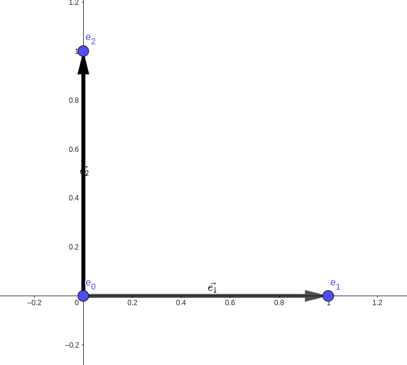

Today we talk about affine spaces over the real numbers.

Lecture highlights:

1. Definition
2. We have a 'dictionary' between vector space and affine space
3. Euclidean space

He finally remembered that he use Einstein notation this time. It also seems like he finally started teaching. Which is perhaps why this lecture was pretty trivial. It's just linear algebra in a new language, which is still equally, if not more, intuitive.

We first give a definition of affine space, taken out of M's notes.

An affine space modelled on a vector space $V$ is a non-empty set $\mathbb{A}$ together with a map 

$$\begin{align*}
T: \mathbb{A}\times V & \to \mathbb{A} \\
(p, \underline{u}) & \mapsto (p + \underline{u})
\end{align*}$$

such that 

1. $(p+\underline{u})+\underline{v} = p + (\underline{u}+\underline{v})$ for any point $p\in \mathbb{A}$ and any vectors $\underline{u}, \underline{v} \in V$,
2. $p+\underline{0} = p$ for any point $p\in\mathbb{A}$,
3. For any two points $p, q \in \mathbb{A}$, there is a unique $\underline{u} \in V$ such that $p+\underline{u} = q$.

For affine spaces, we have a dictionary with vector space. Here we will put down some more words and more different definitions

- affine structure
- affine combination (centre of mass) is some sum $\sum \alpha^i p_i$, where $\sum \alpha^i = 1$ 
- affine frame is a 'basis' for affine spaces: $\mathcal{F} = \{p_0, \dots, p_n\}$, note the number of elements
- model affine space $\mathbb{A}^n_{\mathbb{R}}$, simiar to model vector space $\mathbb{R}^n$

The point-vector correspondence makes a comeback. Again, the below is not actually a commutative diagram

<!-- https://q.uiver.app/#q=WzAsMTIsWzAsMCwicCJdLFsxLDAsIlxcb3ZlcnJpZ2h0YXJyb3d7cF8wIHB9Il0sWzAsMSwicF8xIl0sWzAsMiwicF8yIl0sWzEsMSwiXFxvdmVycmlnaHRhcnJvd3twXzAgcF8xfSJdLFsxLDIsIlxcb3ZlcnJpZ2h0YXJyb3d7cF8wIHBfMn0iXSxbMiwwLCJcXGFscGhhXzFcXG92ZXJyaWdodGFycm93e3BfMCBwXzF9ICsgXFxhbHBoYV8yXFxvdmVycmlnaHRhcnJvd3twXzAgcF8yfSJdLFszLDAsIlxcYmVnaW57cG1hdHJpeH0gXFxhbHBoYV8xIFxcXFwgXFxhbHBoYV8yIFxcZW5ke3BtYXRyaXh9X1xcbWF0aGNhbHtCfSJdLFs0LDAsIlxcbWF0aGJie1J9Il0sWzIsMiwicD1cXGFscGhhXzEgcF8xICsgXFxhbHBoYV8yIHBfMiArICgxLVxcYWxwaGFfMS1cXGFscGhhXzIpcF8wIl0sWzQsMiwiKFxcYWxwaGFfMSwgXFxhbHBoYV8yKV9cXG1hdGhjYWx7Rn0iXSxbNSwyLCJcXG1hdGhiYntBfV4yX1xcbWF0aGJie1J9Il0sWzAsMSwiIiwwLHsic3R5bGUiOnsidGFpbCI6eyJuYW1lIjoiYXJyb3doZWFkIn19fV0sWzIsNCwiIiwwLHsic3R5bGUiOnsidGFpbCI6eyJuYW1lIjoiYXJyb3doZWFkIn19fV0sWzMsNSwiIiwwLHsic3R5bGUiOnsidGFpbCI6eyJuYW1lIjoiYXJyb3doZWFkIn19fV0sWzgsMTAsIiIsMCx7InNob3J0ZW4iOnsic291cmNlIjoyMCwidGFyZ2V0IjoyMH0sInN0eWxlIjp7InRhaWwiOnsibmFtZSI6ImFycm93aGVhZCJ9fX1dLFs2LDEsIiIsMix7InNob3J0ZW4iOnsic291cmNlIjoyMCwidGFyZ2V0IjoyMH0sImxldmVsIjoyLCJzdHlsZSI6eyJoZWFkIjp7Im5hbWUiOiJub25lIn19fV0sWzYsOSwiIiwwLHsic2hvcnRlbiI6eyJzb3VyY2UiOjIwLCJ0YXJnZXQiOjIwfSwic3R5bGUiOnsidGFpbCI6eyJuYW1lIjoiYXJyb3doZWFkIn19fV0sWzYsNywiIiwwLHsic2hvcnRlbiI6eyJzb3VyY2UiOjIwLCJ0YXJnZXQiOjIwfSwic3R5bGUiOnsidGFpbCI6eyJuYW1lIjoiYXJyb3doZWFkIn19fV0sWzEwLDksIiIsMSx7InNob3J0ZW4iOnsic291cmNlIjoyMCwidGFyZ2V0IjoyMH0sInN0eWxlIjp7InRhaWwiOnsibmFtZSI6ImFycm93aGVhZCJ9fX1dLFs3LDgsIlxcaW4iLDEseyJzdHlsZSI6eyJib2R5Ijp7Im5hbWUiOiJub25lIn0sImhlYWQiOnsibmFtZSI6Im5vbmUifX19XSxbMTAsMTEsIlxcaW4iLDEseyJzdHlsZSI6eyJib2R5Ijp7Im5hbWUiOiJub25lIn0sImhlYWQiOnsibmFtZSI6Im5vbmUifX19XV0= -->
<iframe class="quiver-embed" src="https://q.uiver.app/#q=WzAsMTIsWzAsMCwicCJdLFsxLDAsIlxcb3ZlcnJpZ2h0YXJyb3d7cF8wIHB9Il0sWzAsMSwicF8xIl0sWzAsMiwicF8yIl0sWzEsMSwiXFxvdmVycmlnaHRhcnJvd3twXzAgcF8xfSJdLFsxLDIsIlxcb3ZlcnJpZ2h0YXJyb3d7cF8wIHBfMn0iXSxbMiwwLCJcXGFscGhhXzFcXG92ZXJyaWdodGFycm93e3BfMCBwXzF9ICsgXFxhbHBoYV8yXFxvdmVycmlnaHRhcnJvd3twXzAgcF8yfSJdLFszLDAsIlxcYmVnaW57cG1hdHJpeH0gXFxhbHBoYV8xIFxcXFwgXFxhbHBoYV8yIFxcZW5ke3BtYXRyaXh9X1xcbWF0aGNhbHtCfSJdLFs0LDAsIlxcbWF0aGJie1J9Il0sWzIsMiwicD1cXGFscGhhXzEgcF8xICsgXFxhbHBoYV8yIHBfMiArICgxLVxcYWxwaGFfMS1cXGFscGhhXzIpcF8wIl0sWzQsMiwiKFxcYWxwaGFfMSwgXFxhbHBoYV8yKV9cXG1hdGhjYWx7Rn0iXSxbNSwyLCJcXG1hdGhiYntBfV4yX1xcbWF0aGJie1J9Il0sWzAsMSwiIiwwLHsic3R5bGUiOnsidGFpbCI6eyJuYW1lIjoiYXJyb3doZWFkIn19fV0sWzIsNCwiIiwwLHsic3R5bGUiOnsidGFpbCI6eyJuYW1lIjoiYXJyb3doZWFkIn19fV0sWzMsNSwiIiwwLHsic3R5bGUiOnsidGFpbCI6eyJuYW1lIjoiYXJyb3doZWFkIn19fV0sWzgsMTAsIiIsMCx7InNob3J0ZW4iOnsic291cmNlIjoyMCwidGFyZ2V0IjoyMH0sInN0eWxlIjp7InRhaWwiOnsibmFtZSI6ImFycm93aGVhZCJ9fX1dLFs2LDEsIiIsMix7InNob3J0ZW4iOnsic291cmNlIjoyMCwidGFyZ2V0IjoyMH0sImxldmVsIjoyLCJzdHlsZSI6eyJoZWFkIjp7Im5hbWUiOiJub25lIn19fV0sWzYsOSwiIiwwLHsic2hvcnRlbiI6eyJzb3VyY2UiOjIwLCJ0YXJnZXQiOjIwfSwic3R5bGUiOnsidGFpbCI6eyJuYW1lIjoiYXJyb3doZWFkIn19fV0sWzYsNywiIiwwLHsic2hvcnRlbiI6eyJzb3VyY2UiOjIwLCJ0YXJnZXQiOjIwfSwic3R5bGUiOnsidGFpbCI6eyJuYW1lIjoiYXJyb3doZWFkIn19fV0sWzEwLDksIiIsMSx7InNob3J0ZW4iOnsic291cmNlIjoyMCwidGFyZ2V0IjoyMH0sInN0eWxlIjp7InRhaWwiOnsibmFtZSI6ImFycm93aGVhZCJ9fX1dLFs3LDgsIlxcaW4iLDEseyJzdHlsZSI6eyJib2R5Ijp7Im5hbWUiOiJub25lIn0sImhlYWQiOnsibmFtZSI6Im5vbmUifX19XSxbMTAsMTEsIlxcaW4iLDEseyJzdHlsZSI6eyJib2R5Ijp7Im5hbWUiOiJub25lIn0sImhlYWQiOnsibmFtZSI6Im5vbmUifX19XV0=&embed" width="1311" height="445" style="border-radius: 8px; border: none;"></iframe>

<!-- % https://q.uiver.app/#q=WzAsMTIsWzAsMCwicCJdLFsxLDAsIlxcb3ZlcnJpZ2h0YXJyb3d7cF8wIHB9Il0sWzAsMSwicF8xIl0sWzAsMiwicF8yIl0sWzEsMSwiXFxvdmVycmlnaHRhcnJvd3twXzAgcF8xfSJdLFsxLDIsIlxcb3ZlcnJpZ2h0YXJyb3d7cF8wIHBfMn0iXSxbMiwwLCJcXGFscGhhXzFcXG92ZXJyaWdodGFycm93e3BfMCBwXzF9ICsgXFxhbHBoYV8yXFxvdmVycmlnaHRhcnJvd3twXzAgcF8yfSJdLFszLDAsIlxcYmVnaW57cG1hdHJpeH0gXFxhbHBoYV8xIFxcXFwgXFxhbHBoYV8yIFxcZW5ke3BtYXRyaXh9X1xcbWF0aGNhbHtCfSJdLFs0LDAsIlxcbWF0aGJie1J9Il0sWzIsMiwicD1cXGFscGhhXzEgcF8xICsgXFxhbHBoYV8yIHBfMiArICgxLVxcYWxwaGFfMS1cXGFscGhhXzIpcF8wIl0sWzQsMiwiKFxcYWxwaGFfMSwgXFxhbHBoYV8yKV9cXG1hdGhjYWx7Rn0iXSxbNSwyLCJcXG1hdGhiYntBfV4yX1xcbWF0aGJie1J9Il0sWzAsMSwiIiwwLHsic3R5bGUiOnsidGFpbCI6eyJuYW1lIjoiYXJyb3doZWFkIn19fV0sWzIsNCwiIiwwLHsic3R5bGUiOnsidGFpbCI6eyJuYW1lIjoiYXJyb3doZWFkIn19fV0sWzMsNSwiIiwwLHsic3R5bGUiOnsidGFpbCI6eyJuYW1lIjoiYXJyb3doZWFkIn19fV0sWzgsMTAsIiIsMCx7InNob3J0ZW4iOnsic291cmNlIjoyMCwidGFyZ2V0IjoyMH0sInN0eWxlIjp7InRhaWwiOnsibmFtZSI6ImFycm93aGVhZCJ9fX1dLFs2LDEsIiIsMix7InNob3J0ZW4iOnsic291cmNlIjoyMCwidGFyZ2V0IjoyMH0sImxldmVsIjoyLCJzdHlsZSI6eyJoZWFkIjp7Im5hbWUiOiJub25lIn19fV0sWzYsOSwiIiwwLHsic2hvcnRlbiI6eyJzb3VyY2UiOjIwLCJ0YXJnZXQiOjIwfSwic3R5bGUiOnsidGFpbCI6eyJuYW1lIjoiYXJyb3doZWFkIn19fV0sWzYsNywiIiwwLHsic2hvcnRlbiI6eyJzb3VyY2UiOjIwLCJ0YXJnZXQiOjIwfSwic3R5bGUiOnsidGFpbCI6eyJuYW1lIjoiYXJyb3doZWFkIn19fV0sWzEwLDksIiIsMSx7InNob3J0ZW4iOnsic291cmNlIjoyMCwidGFyZ2V0IjoyMH0sInN0eWxlIjp7InRhaWwiOnsibmFtZSI6ImFycm93aGVhZCJ9fX1dLFs3LDgsIlxcaW4iLDEseyJzdHlsZSI6eyJib2R5Ijp7Im5hbWUiOiJub25lIn0sImhlYWQiOnsibmFtZSI6Im5vbmUifX19XSxbMTAsMTEsIlxcaW4iLDEseyJzdHlsZSI6eyJib2R5Ijp7Im5hbWUiOiJub25lIn0sImhlYWQiOnsibmFtZSI6Im5vbmUifX19XV0=
\[\begin{tikzcd}
	p & {\overrightarrow{p_0 p}} & {\alpha_1\overrightarrow{p_0 p_1} + \alpha_2\overrightarrow{p_0 p_2}} & {\begin{pmatrix} \alpha_1 \\ \alpha_2 \end{pmatrix}_\mathcal{B}} & {\mathbb{R}} \\
	{p_1} & {\overrightarrow{p_0 p_1}} \\
	{p_2} & {\overrightarrow{p_0 p_2}} & {p=\alpha_1 p_1 + \alpha_2 p_2 + (1-\alpha_1-\alpha_2)p_0} && {(\alpha_1, \alpha_2)_\mathcal{F}} & {\mathbb{A}^2_\mathbb{R}}
	\arrow[tail reversed, from=1-1, to=1-2]
	\arrow[tail reversed, from=2-1, to=2-2]
	\arrow[tail reversed, from=3-1, to=3-2]
	\arrow[shorten <=7pt, shorten >=7pt, tail reversed, from=1-5, to=3-5]
	\arrow[shorten <=9pt, shorten >=9pt, Rightarrow, no head, from=1-3, to=1-2]
	\arrow[shorten <=7pt, shorten >=7pt, tail reversed, from=1-3, to=3-3]
	\arrow[shorten <=9pt, shorten >=9pt, tail reversed, from=1-3, to=1-4]
	\arrow[shorten <=10pt, shorten >=10pt, tail reversed, from=3-5, to=3-3]
	\arrow["\in"{description}, draw=none, from=1-4, to=1-5]
	\arrow["\in"{description}, draw=none, from=3-5, to=3-6]
\end{tikzcd}\] -->

The below diagram illustrates the relationship between the standard basis and the standard frame (on $\mathbb{R}$). Sorry I don't know how to use Geogebra.

There is the notion of linear independence for vector spaces, what is affine independence? 

The set of points $p_0, \dots, p_n$ is affine  independent if and only if the vectors $p_1-p_0, \dots, p_k-p_0$ are linearly independent on $V$. This is a shit definition and I don't like it because it uses the language of vector spaces. M tried to give a purely affine definition but gave up...

Affine span, I think the reader knows what it is.

Consider $T: V_1 \to V_2$.  From linear algebra, we know that $T^{-1}(\underline{u})$ is a vector subspace only if $\underline{u} = \underline{0}$. Now we know that in other cases we have affine subspaces.

An map $F$ is affine if $F(c^ip_i) = c^i F(p_i)$, in other words, it respects the affine structure or commutes with affine combination.

Below we have the similar diagrams for trivialisations of vector and affine spaces:

<!-- https://q.uiver.app/#q=WzAsNixbMCwwLCJWXzEiXSxbMSwwLCJWXzIiXSxbMCwxLCJcXG1hdGhiYntSfV5uIl0sWzEsMSwiXFxtYXRoYmJ7Un1ebSJdLFswLDIsIlxcdmVje3h9Il0sWzEsMiwiQVxcdmVje3h9Il0sWzAsMSwiVCJdLFsyLDMsIkEiXSxbNCw1LCIiLDAseyJzdHlsZSI6eyJ0YWlsIjp7Im5hbWUiOiJtYXBzIHRvIn19fV0sWzAsMiwiWyBcXDsgXV9cXG1hdGhjYWx7Ql8xfSIsMl0sWzEsMywiW1xcO11fe1xcbWF0aGNhbHtCXzJ9fSIsMl0sWzQsMiwiXFxpbiJdLFs1LDMsIlxcaW4iXV0= -->
<iframe class="quiver-embed" src="https://q.uiver.app/#q=WzAsNixbMCwwLCJWXzEiXSxbMSwwLCJWXzIiXSxbMCwxLCJcXG1hdGhiYntSfV5uIl0sWzEsMSwiXFxtYXRoYmJ7Un1ebSJdLFswLDIsIlxcdmVje3h9Il0sWzEsMiwiQVxcdmVje3h9Il0sWzAsMSwiVCJdLFsyLDMsIkEiXSxbNCw1LCIiLDAseyJzdHlsZSI6eyJ0YWlsIjp7Im5hbWUiOiJtYXBzIHRvIn19fV0sWzAsMiwiWyBcXDsgXV9cXG1hdGhjYWx7Ql8xfSIsMl0sWzEsMywiW1xcO11fe1xcbWF0aGNhbHtCXzJ9fSIsMl0sWzQsMiwiXFxpbiJdLFs1LDMsIlxcaW4iXV0=&embed" width="304" height="432" style="border-radius: 8px; border: none;"></iframe>

<!-- % https://q.uiver.app/#q=WzAsNixbMCwwLCJWXzEiXSxbMSwwLCJWXzIiXSxbMCwxLCJcXG1hdGhiYntSfV5uIl0sWzEsMSwiXFxtYXRoYmJ7Un1ebSJdLFswLDIsIlxcdmVje3h9Il0sWzEsMiwiQVxcdmVje3h9Il0sWzAsMSwiVCJdLFsyLDMsIkEiXSxbNCw1LCIiLDAseyJzdHlsZSI6eyJ0YWlsIjp7Im5hbWUiOiJtYXBzIHRvIn19fV0sWzAsMiwiWyBcXDsgXV9cXG1hdGhjYWx7Ql8xfSIsMl0sWzEsMywiW1xcO11fe1xcbWF0aGNhbHtCXzJ9fSIsMl0sWzQsMiwiXFxpbiJdLFs1LDMsIlxcaW4iXV0=
\[\begin{tikzcd}
	{V_1} & {V_2} \\
	{\mathbb{R}^n} & {\mathbb{R}^m} \\
	{\vec{x}} & {A\vec{x}}
	\arrow["T", from=1-1, to=1-2]
	\arrow["A", from=2-1, to=2-2]
	\arrow[maps to, from=3-1, to=3-2]
	\arrow["{[ \; ]_\mathcal{B_1}}"', from=1-1, to=2-1]
	\arrow["{[\;]_{\mathcal{B_2}}}"', from=1-2, to=2-2]
	\arrow["\in", from=3-1, to=2-1]
	\arrow["\in", from=3-2, to=2-2]
\end{tikzcd}\] -->

<!-- https://q.uiver.app/#q=WzAsOCxbMCwwLCJcXG1hdGhiYntBfV8xIl0sWzEsMCwiXFxtYXRoYmJ7QX1fMiJdLFswLDEsIlxcbWF0aGJie0F9Xm5fXFxtYXRoYmJ7Un0iXSxbMSwxLCJcXG1hdGhiYntBfV5tX1xcbWF0aGJie1J9Il0sWzAsMiwiXFxtYXRoYmJ7Un1ebiJdLFsxLDIsIlxcbWF0aGJie1J9Xm0iXSxbMCwzLCJcXHZlY3t4fSJdLFsxLDMsIkFcXHZlY3t4fStcXHZlY3tifSJdLFswLDEsIkYiXSxbMiwzLCI/Pz8iXSxbMCwyLCJbXFw7XV9cXG1hdGhjYWx7Rl8xfSIsMl0sWzEsMywiW1xcO11fXFxtYXRoY2Fse0ZfMn0iLDJdLFs0LDUsIkEiXSxbMiw0LCIiLDAseyJzdHlsZSI6eyJ0YWlsIjp7Im5hbWUiOiJhcnJvd2hlYWQifX19XSxbNSwzLCIiLDAseyJzdHlsZSI6eyJ0YWlsIjp7Im5hbWUiOiJhcnJvd2hlYWQifX19XSxbNiw3XSxbNiw0LCJcXGluIl0sWzcsNSwiXFxpbiJdXQ== -->
<iframe class="quiver-embed" src="https://q.uiver.app/#q=WzAsOCxbMCwwLCJcXG1hdGhiYntBfV8xIl0sWzEsMCwiXFxtYXRoYmJ7QX1fMiJdLFswLDEsIlxcbWF0aGJie0F9Xm5fXFxtYXRoYmJ7Un0iXSxbMSwxLCJcXG1hdGhiYntBfV5tX1xcbWF0aGJie1J9Il0sWzAsMiwiXFxtYXRoYmJ7Un1ebiJdLFsxLDIsIlxcbWF0aGJie1J9Xm0iXSxbMCwzLCJcXHZlY3t4fSJdLFsxLDMsIkFcXHZlY3t4fStcXHZlY3tifSJdLFswLDEsIkYiXSxbMiwzLCI/Pz8iXSxbMCwyLCJbXFw7XV9cXG1hdGhjYWx7Rl8xfSIsMl0sWzEsMywiW1xcO11fXFxtYXRoY2Fse0ZfMn0iLDJdLFs0LDUsIkEiXSxbMiw0LCIiLDAseyJzdHlsZSI6eyJ0YWlsIjp7Im5hbWUiOiJhcnJvd2hlYWQifX19XSxbNSwzLCIiLDAseyJzdHlsZSI6eyJ0YWlsIjp7Im5hbWUiOiJhcnJvd2hlYWQifX19XSxbNiw3XSxbNiw0LCJcXGluIl0sWzcsNSwiXFxpbiJdXQ==&embed" width="334" height="560" style="border-radius: 8px; border: none;"></iframe>

<!-- % https://q.uiver.app/#q=WzAsOCxbMCwwLCJcXG1hdGhiYntBfV8xIl0sWzEsMCwiXFxtYXRoYmJ7QX1fMiJdLFswLDEsIlxcbWF0aGJie0F9Xm5fXFxtYXRoYmJ7Un0iXSxbMSwxLCJcXG1hdGhiYntBfV5tX1xcbWF0aGJie1J9Il0sWzAsMiwiXFxtYXRoYmJ7Un1ebiJdLFsxLDIsIlxcbWF0aGJie1J9Xm0iXSxbMCwzLCJcXHZlY3t4fSJdLFsxLDMsIkFcXHZlY3t4fStcXHZlY3tifSJdLFswLDEsIkYiXSxbMiwzLCI/Pz8iXSxbMCwyLCJbXFw7XV9cXG1hdGhjYWx7Rl8xfSIsMl0sWzEsMywiW1xcO11fXFxtYXRoY2Fse0ZfMn0iLDJdLFs0LDUsIkEiXSxbMiw0LCIiLDAseyJzdHlsZSI6eyJ0YWlsIjp7Im5hbWUiOiJhcnJvd2hlYWQifX19XSxbNSwzLCIiLDAseyJzdHlsZSI6eyJ0YWlsIjp7Im5hbWUiOiJhcnJvd2hlYWQifX19XSxbNiw3XSxbNiw0LCJcXGluIl0sWzcsNSwiXFxpbiJdXQ==
\[\begin{tikzcd}
	{\mathbb{A}_1} & {\mathbb{A}_2} \\
	{\mathbb{A}^n_\mathbb{R}} & {\mathbb{A}^m_\mathbb{R}} \\
	{\mathbb{R}^n} & {\mathbb{R}^m} \\
	{\vec{x}} & {A\vec{x}+\vec{b}}
	\arrow["F", from=1-1, to=1-2]
	\arrow["{???}", from=2-1, to=2-2]
	\arrow["{[\;]_\mathcal{F_1}}"', from=1-1, to=2-1]
	\arrow["{[\;]_\mathcal{F_2}}"', from=1-2, to=2-2]
	\arrow["A", from=3-1, to=3-2]
	\arrow[tail reversed, from=2-1, to=3-1]
	\arrow[tail reversed, from=3-2, to=2-2]
	\arrow[from=4-1, to=4-2]
	\arrow["\in", from=4-1, to=3-1]
	\arrow["\in", from=4-2, to=3-2]
\end{tikzcd}\] -->

The double arrows stand for point-vector correspondence. We have a problem with the ??? since we do not have matrices for affine transformations on trivialisations of affine spaces! Therefore we need the point-vector correspondence to obtain a representation of $F$, which we notate with $[A, \vec{b}]$

I am not sure if $\vec{b}$ is arbitrary. Apparently we can have a normal form $\left[\begin{pmatrix}\mathbf{I}_r & \mathbf{O} \\ \mathbf{O} & \mathbf{O}\end{pmatrix} \mid \begin{pmatrix}\mathbf{O} \\ \mathbf{O}\end{pmatrix}\right]$ but I am not sure why the bottom half of $\vec{b}$ can be made zero by row/column operations.   

BTW, it is pretty trash that he uses $F$ to denote both affine transformation and affine frame. 

We draw a vector space by [picture] and an affine space by [picture]

We define the tangent space $T_0 \mathbb{A}$, which is a vector space, of $\mathbb{A}$ at the point $O$. 

We have a more abstract definition of an affine space. An affine space over $\mathbb{R}$ is a principal $G=(V,+)$-set for a real linear space $V$ of dimension $n$. Where we have the action I am pretty sure I have this in a former post.

Now we properly define what is an Euclidean space. An Euclidean space is an affine space with Euclidean structure.

My notes here on are pretty messy. Tidy up at another time. Basically any transformation preserves inner product.